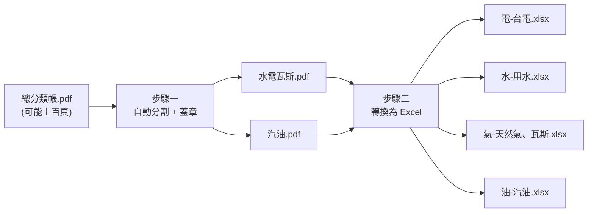

# 碳健檢資料前處理工具

**把「總分類帳 PDF」自動變成碳盤查平台可直接上傳的 Excel —— 免手動翻找、免格式除錯、免裝 Python。**

會計師事務所、記帳士、ESG／碳盤查顧問常見的痛點：客戶一份總分類帳動輒上百頁，要人工翻出水電瓦斯、燃料費的分錄，重新謄寫進碳排放盤查平台指定的 Excel 範本，還要蓋上公司大小章證明文件真實性。資料多、格式龜毛（差一個儲存格屬性就整份被平台退件），一個客戶就得花上大半天，多客戶案量更是雪上加霜。

這個工具把上述流程自動化：丟進總分類帳資料夾，一鍵批次處理多位客戶，幾秒內產出蓋好章的分割 PDF，以及可直接上傳、格式完全合規的水電瓦斯／燃料 Excel。

> 🔒 **資料不外流**：所有處理都在你自己的電腦上執行，客戶的財務資料不會上傳到任何伺服器或雲端。

---

## 核心功能

- **批次處理多位客戶**：一個資料夾丟進所有客戶的總分類帳，逐一自動處理，結果依客戶分資料夾打包下載
- **自動分割 + 蓋章**：從總分類帳中辨識水電瓦斯費、燃料費頁面，另存為獨立 PDF，並在最後一頁自動蓋上公司大小章
- **一鍵產生上傳用 Excel**：電費、水費、天然氣／瓦斯、汽油費用自動轉換為碳盤查平台指定範本格式
- **修補平台上傳規則**：自動修正 Excel 內部格式（字串型別、共用字串索引、列格式屬性等），避免手動複製格式才能上傳成功的麻煩
- **網頁介面，免寫程式**：拖曳資料夾、填年份、按一下即可執行，不需要任何程式基礎
- **免安裝 Python**：提供 macOS / Windows 打包好的應用程式，下載後雙擊即可使用

---

## 運作流程



多位客戶可同時處理，最終結果依客戶名稱分資料夾打包成一個 ZIP 下載。

---

## 畫面預覽


操作流程：選擇年份 →拖曳選擇「總分類帳資料夾」與「大小章資料夾」→ 按「執行前處理」→ 下載結果 ZIP。

---

## 快速開始

### 方式一：直接下載使用（推薦，非工程背景可用）

前往 [Releases](https://github.com/tingjie19/Carbon-emission-data-preprocessing/releases/latest) 下載對應系統的版本：

- **macOS**：下載 `碳健檢前處理工具-macOS.zip`，解壓縮後雙擊 `.app` 執行
- **Windows**：下載 `碳健檢前處理工具-Windows.zip`，解壓縮後執行資料夾內的 `.exe`

開啟後瀏覽器會自動跳出操作頁面（`http://localhost:7860`）。

### 方式二：以原始碼執行（開發者）

```bash
pip install -r requirements.txt
python app.py
```

---

## 使用前準備

| 項目 | 說明 |
|------|------|
| 總分類帳資料夾 | 內含多份 `{客戶名稱}{民國年}總分類帳.pdf`（必填） |
| 大小章資料夾 | 內含 `去背_大章.png` 與 `去背_小章.png`（選填，若需自動蓋章才提供） |
| 民國年份 | 對應總分類帳的會計年度 |

---

## 系統需求

- macOS 或 Windows（打包版免裝任何額外軟體）
- 或 Python 3.11+（以原始碼執行時）

---

## 專案結構

```
app.py                    # Flask 網頁應用程式入口
templates/index.html      # 操作介面
scripts/
  split_ledger.py         # 步驟一：總分類帳分割 + 蓋章
  process_utilities.py    # 步驟二：水電瓦斯 Excel 轉換
  process_gasoline.py     # 步驟二：汽油 Excel 轉換
範例/                      # Excel 輸出範本
build.spec                 # PyInstaller 打包設定
.github/workflows/         # 推送 tag 自動打包 macOS/Windows 安裝檔
```
